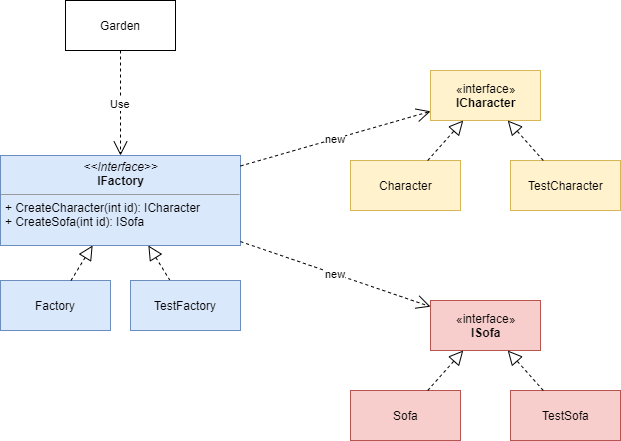

## ストーリー

ハコニワを作成したい。

ハコニワにはキャラクターとソファー（合わせてモノと表現する）を置ける。

ハコニワは下の条件で作られる。

* キャラクターとソファーにはコストの概念がある。
* ユーザーのレベルが上がると、扱えるコストの最大値が増加する
* キャラクターは設置した場所の周辺を動き回る。
* ソファは移動しない。
* キャラクターとソファーはそれぞれ重なるように設置できない。
* ハコニワにはコストとは別に最大設置可能数が設定される。

以上のように、ロジックが複雑化することが見えているので、ハコニワのロジックはテストが行えるようにしたい。

# クラス図

# 思うところ

Factoryもインターフェース、生成対象もインターフェースになっているので、生成対象を一式まとめて入れ替えたい合に便利です。

今回のように、テスト用に入れ替えられるようにすることも有用ですが、他にも、

* AndroidとiOSでそれぞれ見た目が異なるコンポーネント（ボタンやラジオボタンなど）を扱いたいが、ロジックは共通化したい
* ゲームのマップを作成するためのマップエディタで、ロジックは共通化したいけど、見た目は動作を軽くするためにテキストで表現したい

なども考えられそうです。

このパターンで重要なポイントは、インターフェースが２箇所にあるというところ。つまり、２箇所で実装を差し替えることで初めて旨味が発生するということです。

使用者が動的にオブジェクトを生成したい場合にはこのパターンがうまく当てはまると思います。

