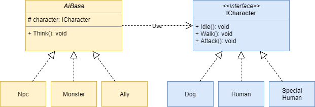

# ストーリー

RPGゲームを作成している。

RPGには大量のキャラクターが登場し、それぞれが固有のAIを持っている。

同じキャラクターでも敵として登場したり、NPCとして登場したりするので、多くのパターンが存在する。

# クラス図

# 思うところ

Bridgeパターンは下のようにAxBの組み合わせが発生するときに有効なパターン。

| |Dog|Human|Special Human|
|---|---|---|---|
|Npc|1-1|1-2|1-3|
|Ally|2-1|2-2|2-3|
|Monster|3-1|3-2|3-3|

今回のサンプルでは素直に全パターン作ろうと思うと3x3=9クラスを作ることになるが、Bridgeパターンを使うことで3+3=6クラスを作成するだけで全パターンを網羅できる。

AxBだけでなく、AxBxCみたいに２つより大きな組み合わせでも有効。

実際のところ、どこをインターフェースとして切り出すかさえ決まってしまえば、後はインターフェースをコンストラクタで渡すだけです。