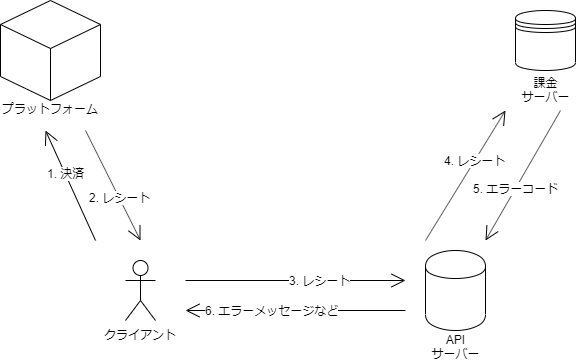
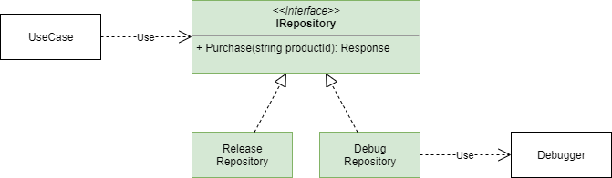

# ストーリー

課金処理を実装したい。

課金処理は以下の流れで処理がされる。

1. クライアントでプラットフォームとの決済を行う
2. クライアントがAPIサーバーにレシートを投げる
3. APIサーバーが課金サーバーにレシート処理を委譲する
4. 課金サーバーがレシートを検証して、エラーなどがあればエラーコードをAPIサーバーに返す
5. APIサーバーがエラーコードに応じたダイアログのタイトル・本文をクライアントに返す
6. 受け取ったレスポンスをダイアログに表示

クライアント側で表示やロジックが正しく動作するか確認したいが、課金サーバーのエラーコードを制御するのが難しい。

そこで、デバッグ用のAPIを用意して、クライアント側でエラーコードをシミュレーションできるような仕組みを作りたい。

# フロー

# クラス図

# 思うところ

