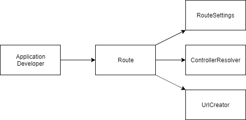

# ストーリー

私はWebアプリケーションフレームワークの開発者だ。

フレームワークの中はメンテナンス性を最大化したいのでクラスの役割を明確にしたい。

ただ、フレームワークの使用者には手軽に扱えるようにしておきたい。

# クラス図

# 思うところ

クラスレベルで詳細をカプセル化するのがオブジェクト指向なら、APIレベルで詳細をカプセル化しているのがFacadeパターン。

自分がFacadeパターンを開発する側にいる場合、開発者都合がAPIに表れてしまうことがあるので、そのクラスを誰が使うのかしっかり認識することが大事。
