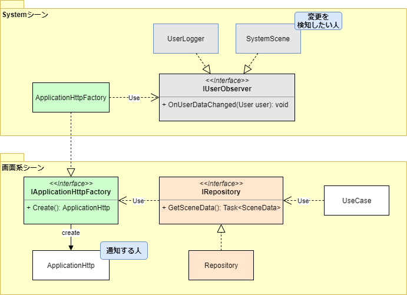

# ストーリー

Unityでユーザーデータをサーバーから取得したい。要件は、
* 通信を行うクラスとユーザーデータを管理するクラスは依存しないようにしたい
* HTTPのリクエスト先のドメインはアプリの途中で変更する可能性がある
* ドメインの変更などは一元管理したい
* ユーザーデータの管理はUseCaseやRepositoryなどで管理すると更新漏れなどが発生するので、処理は１箇所で行いたい
* 可能な限り依存関係を減らしたい

特に１つ目を達成するために、今回はObserverパターンを適用する

# クラス図

# 思うところ

「通知する人」と「変更を検知したい人」が少し遠くにあるパターンを実装してみました。

今回のサンプルのようにHTTP通信で取得したユーザーデータをクライアント側で保持したり、差分で更新したいということはよくあると思います。

パターンを使用せずにSystemSceneが保持しているユーザーデータを更新したい場合、ApplicationHttpがSystemSceneのユーザーデータを更新メソッドを呼ぶことになります。依存関係はこのようになります。

**ApplicationHttp ---use--> SystemScene**

この場合には、下のような問題を含むことになります。

* ApplicationHttpが直接SystemSceneを参照することになるので、SystemSceneの変更の影響を受けやすい。
* ApplicationHttpクラスが他のクラスにもユーザーデータを通知したい場合、それらのクラスも参照する必要がある。

Observerパターンを適用することでApplicationHttpクラスがSystemSceneに依存することがなくなったため、上記問題が解消されています。

