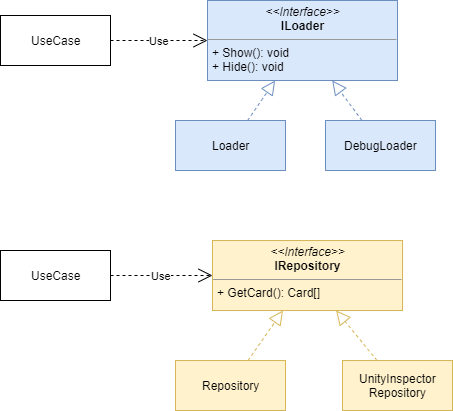

# ストーリー

ユーザーが所持しているカード一覧を表示する画面を作りたい。

画面はその画面単体で動作させるようにしたいし、デバッグ用に色々なデータを流せるようにしたい。

# クラス図

# 思うところ

Strategyパターンは今回のサンプルのように実行中には動作が変わらないような場合でも、それがランタイムでどんどん差し替わるようなものでも、単純にインターフェースを使って処理を切り替えるだけと言えます。

デザインパターンが登場したときには、HOW（どういうふうに書くのか）に着目してインターフェースの有効性を示したと思いますが、もうちょっと視野を広くしてWHY（何のために）意識して設計はすべきかなと感じます。

例えば、

* ロジックの単体テストを行うために、DI（Dependency Injection）を適用する。
* デバッグのために本来見えない部分を可視化したいので、ランタイムで実装を差し替えられるようにStrategyパターンを適用する。
* α開発のタイミングでは通信の仕組みを実装するよりも他の項目の方が優先度が高いので、API通信を行うことなく動作するようにしたい。

これらはいずれもインターフェースを使用して実装を差し替えられるように作るだけなので、構造的にはいずれもStrategyパターンとなります。

